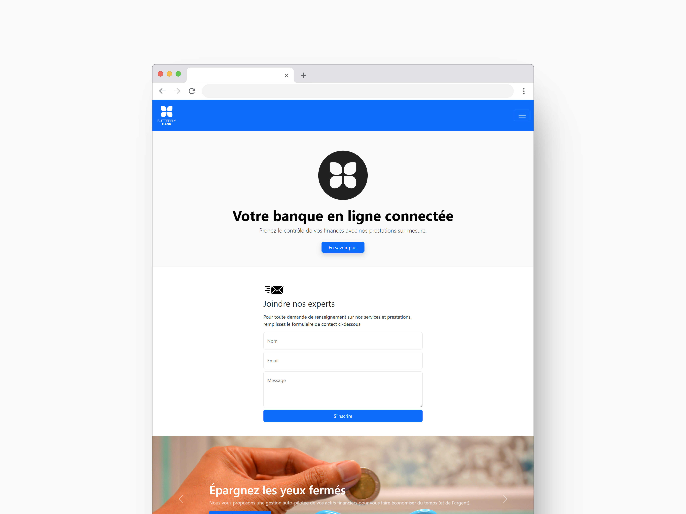

### Consignes

1. Créer une nouvelle page HTML autonome incluant Bootstrap 5 via CDN.
2. Inclure un formulaire de contact
3. Créer un carousel Bootstrap avec 3 images libres de droits, légendes, flèches, et indicateurs.
4. Créer un accordion avec au moins 3 rubriques : "À propos", "Services", "Conditions générales".
5. Créer une modale d'inscription : ajouter un bouton "S’inscrire" qui déclenche une modale avec un formulaire email/mot de passe.

### Screenshot

### Aperçu en direct

- Lien vers l'aperçu du site : [Aperçu en direct](https://marioncts.github.io/exo-bootstrap/)
